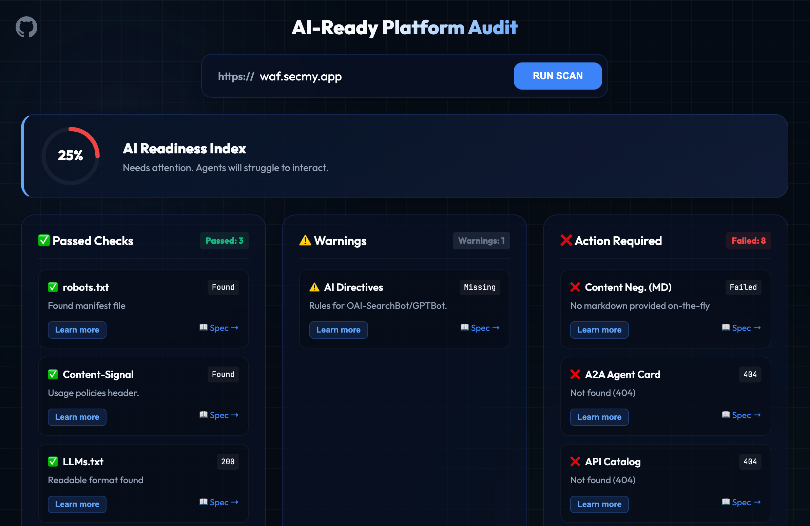

# AI-Valid | AI Readiness Audit 🛡️

**AI-Valid** is a professional, high-fidelity auditing tool designed to evaluate how "AI-ready" your website or platform is. As the web transitions from human-only consumption to autonomous agent interaction, AI-Valid helps developers and business owners ensure their data is accessible, correctly signaled, and compatible with modern AI standards.



## 🌟 Key Features

- **Weighted readiness score**: A percentage of the weight actually available, with a letter grade and a per-category breakdown — not a raw count of passing checks.
- **Prioritised fixes**: A ranked shortlist of the failures that move the score most, each with a ready-to-use remediation prompt carrying your domain and the specific finding.
- **Semantic Protocol Discovery**: Automatically scans for `.well-known` manifests including MCP (Model Context Protocol), A2A Agent Cards, API Catalogs (RFC 9727), and AI Plugins.
- **Bot Accessibility Audit**: Validates `robots.txt` and explicit AI directives for `OAI-SearchBot`, `GPTBot`, and others.
- **Content Optimization**: Checks server-side rendering, structured data, content negotiation (Markdown support) and legal usage signals via `Content-Signal` headers.
- **MCP server**: The auditor is itself callable as a tool from any MCP client.
- **Actionable Dashboard**: Results are categorized into **Passed**, **Warnings**, & **Not found**, providing a clear implementation roadmap.
- **Deep Linking**: Share audit results easily via persistent URL hashes.

## 📊 How the score works

Every check carries a weight reflecting how much it actually matters — from **10** (table
stakes; a site that misses these is unreadable to agents) down to **1** (niche protocols that
only apply to some sites). The score is the percentage of *available* weight earned, so a
missing `<title>` costs far more than a missing commerce manifest.

Checks that report a **policy choice** rather than a defect — whether to block AI training,
whether to declare a TDM reservation — are marked `advisory` and left out of the score
entirely. Choosing to welcome AI training is a legitimate decision, and the audit reports it
without penalising it either way.

A resource that exists but sits behind authentication earns partial credit rather than nothing.

## 🔌 Using it as an API or MCP tool

```bash
# JSON
curl "https://ai-valid.secmy.app/api/audit?targetUrl=https://example.com"

# Markdown report
curl -H 'Accept: text/markdown' "https://ai-valid.secmy.app/api/audit?targetUrl=https://example.com"

# As an MCP tool
curl -X POST https://ai-valid.secmy.app/mcp \
  -H 'Content-Type: application/json' \
  -d '{"jsonrpc":"2.0","id":1,"method":"tools/list"}'
```

The OpenAPI description lives at [`/openapi.json`](https://ai-valid.secmy.app/openapi.json),
and the MCP server card at
[`/.well-known/mcp/server-card.json`](https://ai-valid.secmy.app/.well-known/mcp/server-card.json).

## 🛠️ Technology Stack

- **Backend**: Cloudflare Workers (High-performance, global edge deployment).
- **Frontend**: Vanilla JavaScript (ES6+), Modern CSS (Glassmorphism), and Semantic HTML5.
- **Deployment**: Wrangler CLI.
- **Performance**: Zero external dependencies on the frontend for lightning-fast loads.

## 🚀 Quick Start

### Prerequisites
- [Node.js](https://nodejs.org/)
- [Wrangler CLI](https://developers.cloudflare.com/workers/wrangler/install-update/)

### Installation
```bash
git clone git@github.com:SecH0us3/ai-valid.git
cd ai-valid/ai-valid
npm install
```

### Local Development
```bash
npx wrangler dev
```

### Tests
```bash
npm test
```

### Deployment
```bash
npx wrangler deploy
```

## 📖 Specifications
AI-Valid audits against several emerging and established standards:
- [llms.txt](https://llmstxt.org/)
- [Model Context Protocol (MCP)](https://modelcontextprotocol.io/)
- [RFC 9727 (API Catalog)](https://www.rfc-editor.org/info/rfc9727)
- [Agent Skills](https://agentskills.io/)

---
Created by [SecH0us3](https://github.com/SecH0us3) ecosystem.
