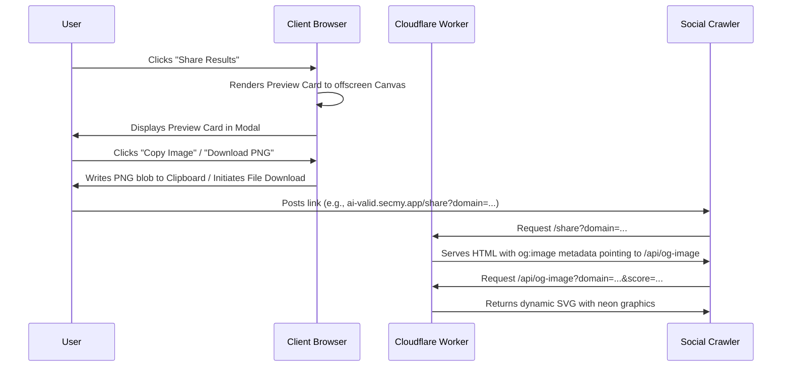

# Design Specification: Share Results Preview Card

This document details the design and implementation of the "Share Results" feature for the AI-Valid platform. This feature allows users to share a visually stunning preview card of their website's AI readiness score on social media and copy/download it directly.

## Goals

- Add a "Share Results" action column directly in the main results dashboard (`.summary-card`).
- Create a beautiful sharing modal showcasing a high-fidelity, tech-themed preview card (Dark & Neon aesthetic).
- Enable users to download the preview card as a PNG image.
- Enable users to copy the preview card as a PNG image directly to their clipboard.
- Provide a prefilled Twitter share button.
- Support server-side rendering of dynamic Open Graph metadata and dynamic SVG image responses in the Cloudflare Worker when a shared link is crawled or visited.

---

## User Interface & Experience (UI/UX)

### 1. Summary Card Integration
A new column is added to the `.summary-card` dashboard.
- On desktop, it is separated by a `.summary-divider` and displays a "Share Results" button with a glowing hover state.
- On mobile (width ≤ 768px), the layout wraps, hiding the vertical dividers, and places the "Share Results" button centered at the bottom of the stack.

### 2. Share Preview Modal
When "Share Results" is clicked, a custom styled modal dialog overlay opens, presenting:
- A live **glowing dark-mode preview card** (rendered at high resolution via an offscreen HTML5 `<canvas>` and displayed on-screen as an image for maximum fidelity and crispness).
- Card design details:
  - Deep space/navy background (`#0b1329`) with a futuristic tech grid.
  - Large circular progress indicator showing the readiness score (e.g. `80%`).
  - Audited domain text (e.g. `example.com`).
  - Breakdown counters: Passed checks (green), Warnings (yellow), and Not Found (red).
  - Branding footer: `AI-Ready Audit | ai-valid.secmy.app`.
- **Action Buttons**:
  - **📋 Copy Image:** Copies the card as a PNG directly to the clipboard using the `navigator.clipboard.write()` API.
  - **📥 Download PNG:** Triggers a browser download of the card as `ai-valid-score.png`.
  - **🐦 Share on X/Twitter:** Opens a new tab with a pre-filled tweet:
    `My website example.com is 80% AI-ready! Scan your site's AI accessibility at https://ai-valid.secmy.app/#example.com #AIReady #WebDev`

---

## Technical Architecture

### 1. Client-Side Rendering (Canvas-based)
- We use a high-DPI scaling factor (2x or 3x) when drawing to `<canvas>` to ensure the generated PNG is crystal clear on Retina/high-res screens.
- Standard fonts (`Outfit` and `JetBrains Mono`) are loaded/declared before drawing text.
- Gradients and drop-shadows are applied programmatically using canvas context APIs.
- The `navigator.clipboard.write([new ClipboardItem({"image/png": blob})])` API is used for the "Copy Image" functionality, with a fallback notification if the Clipboard API is blocked or unsupported in some browsers.

### 2. Server-Side Routing (Cloudflare Worker)
Two new routes are added to the Cloudflare Worker:
1. **`/share` (GET)**: Serves a lightweight HTML page for social crawlers (and users who click the link).
   - The query parameters `domain`, `passed`, `warn`, and `fail` are parsed from the URL.
   - The overall score is calculated as `totalPassed / (totalPassed + totalWarnings + totalFailed) * 100` (or passed directly via query parameters).
   - Populates Open Graph (`og:*`) and Twitter Card (`twitter:*`) tags.
   - For regular users, this page redirects to the main app with the target domain in the hash (e.g., `https://ai-valid.secmy.app/#example.com`), triggering an automatic re-audit or viewing experience.
2. **`/api/og-image` (GET)**: Generates a beautiful SVG representation of the preview card.
   - Formats a clean XML SVG string containing a dark background, grid, glowing radial gauge, text nodes for counts, and branding.
   - Served with `Content-Type: image/svg+xml` and appropriate caching headers.

---

## Proposed File Changes

### 1. [index.html](file:///Users/alex/src/agent-check/ai-valid/public/index.html) [MODIFY]
- Add the new "Share Results" column markup to `#results-dashboard`.
- Add a new `<dialog>` or custom modal overlay `#share-modal` to house the preview card image and action buttons.

### 2. [style.css](file:///Users/alex/src/agent-check/ai-valid/public/style.css) [MODIFY]
- Add styles for the "Share Results" button.
- Add responsive media queries to wrap the summary card on mobile.
- Style the share modal and buttons (`.share-modal`, `.preview-card-container`, `.action-grid`, etc.).
- Design the glow states and neon colors.

### 3. [app.client.js](file:///Users/alex/src/agent-check/ai-valid/public/app.client.js) [MODIFY]
- Register click listeners for the share button.
- Implement the offscreen Canvas drawer that compiles the score, domain, and checks into a high-DPI image blob.
- Connect the copy, download, and Twitter share buttons.
- Update `renderResults` to pass the results context to the share generator.

### 4. [index.js](file:///Users/alex/src/agent-check/ai-valid/src/index.js) [MODIFY]
- Extend `STATIC_ROUTES` or handle requests inside `handleRequest` for `/share` and `/api/og-image`.
- Write the SVG template generator function.

---

## Verification Plan

### Automated Tests
- Extend Vitest tests in `tests/static-routes.test.js` or `tests/index.test.js` to assert that:
  - `/share` returns a 200 OK with HTML containing the correct `<meta property="og:image"...>` tags.
  - `/api/og-image` returns `image/svg+xml` and contains the domain and scores in the SVG content.
- Run `npm test` to ensure all tests pass.

### Manual Verification
- Run wrangler local dev server: `npm run dev`
- Run a site scan and verify the "Share Results" button appears.
- Open the modal, check that the card looks beautiful, and test:
  - Copying the image (paste it into another app).
  - Downloading the PNG (open the file and verify resolution/correctness).
  - Click the Twitter Share button (ensure the pre-filled URL is correct).
- Fetch `/share?domain=test.com&passed=10&warn=5&fail=2` in the browser and verify it redirects to `/#test.com` for users while serving HTML tags to crawlers.
